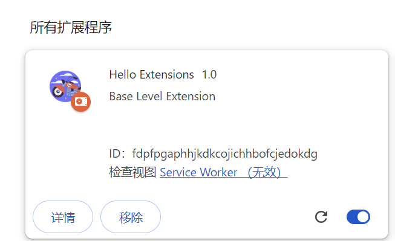
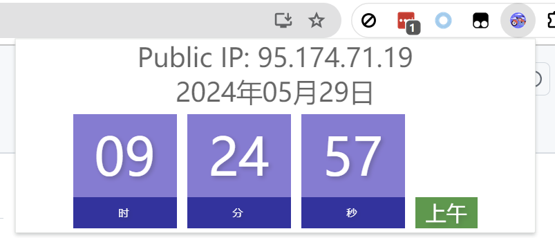
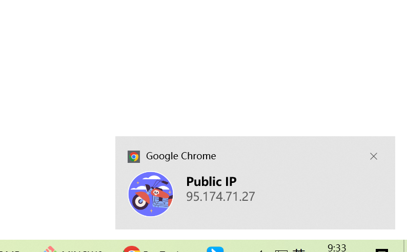

## Create Chrome Plugin V3

### file explain
manifest.json 文件必需的字段
manifest_version：用于指定扩展程序使用的清单文件格式版本，目前是 3
name：插件名称，一般情况下 hover 插件图标展示的文案也是 name
version：插件版本
description：插件描述
icons：图标

操作项（Action）
```shell
"icons": {
    "48": "motorcycle48.png", // show icon in extension page
    "128": "motorcycle.png" // show icon in chrome bar
},
"action": {
    "default_icon": "icon/motorcycle.png",
    "default_title": "hello world Title",
    "default_popup": "hello.html"
  }
```

Service Worker 在后台运行并处理浏览器事件
```shell
{
  "background": {
    "service_worker": "service_worker.js",
    "type": "module"
  }
}
```

在网页环境中运行 JavaScript 或 CSS。 通过 content_scripts 进行注册。

```shell
"content_scripts": [
  {
    "matches": ["http://*/*","https://*/*"],
    "js": ["content_scripts.js"]
  }
]
```

### DEMO



